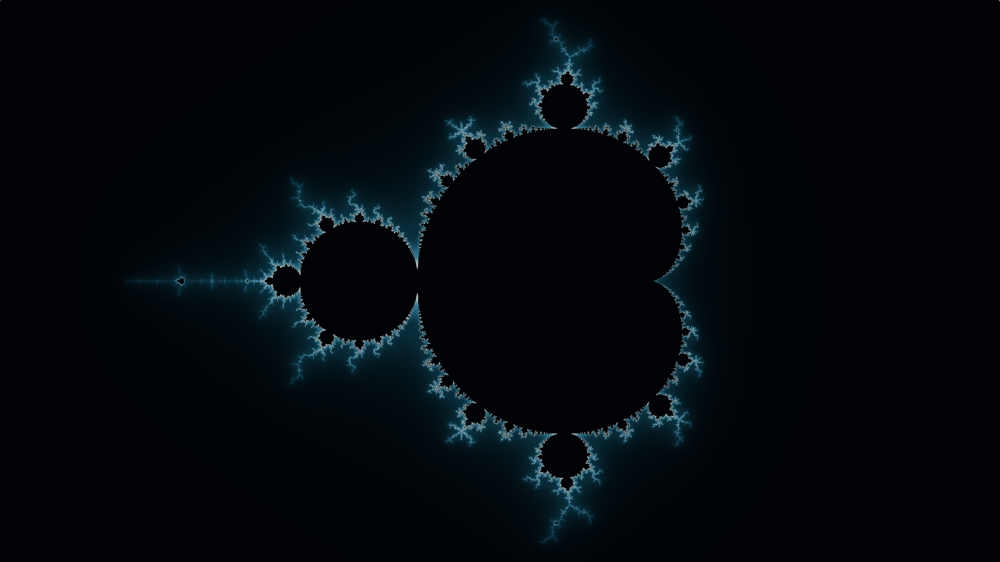

# Fractals
 
 View them with the [Fractal Viewer](https://darkeclipz.github.io/fractals/). Currently the following are implemented:
 
  * Burning ship + julia

# GLSL code for Mandelbrot

An attempt to create a short, and fast, implementation for the Mandelbrot set in GLSL. Currently it stands at 176 characters, which is a little more than half a tweet.

```glsl
#define R iResolution.xy
void mainImage( out vec4 O, in vec2 I ) {
    vec2 c = ( 2.*I - R ) / R.y, z = 0./R; 
    float i = 0.;
	for(; ++i <= 64. && dot(z,z) < 4. ;)
        z = mat2( z, -z.y, z.x ) * z + c;
    O = vec4(vec3( i / 64. ), 1.0);
}
```

You can test it at [Shadertoy](https://www.shadertoy.com/new).

# Screenshots

In the `screenshots` folder are quite a few pictures. :)

## Mandelbrot



 # GLSL code
 
 Implementations of the fractals on ShaderToy:

 * https://www.shadertoy.com/view/MltyR8
 * https://www.shadertoy.com/view/XlcyR4
 * https://www.shadertoy.com/view/Xl3cR4
 * https://www.shadertoy.com/view/MtccR4
 * https://www.shadertoy.com/view/ltccRN
